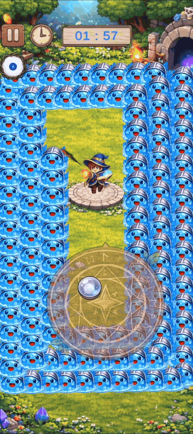

# Slime Defense

Unity ECS(DOTS)를 활용해 개발한 모바일 2D 디펜스 게임입니다.  
플레이어는 고정된 위치에서 기본 무기의 조준 방향을 조절하고, 관통 공격으로 경로를 따라오는 슬라임을 처치합니다.  
다수의 적과 투사체가 동시에 처리되는 상황에서도 안정적인 전투 흐름을 유지하는 것을 목표로 개발했습니다.

## Preview



## Links

- 요약 및 설명 영상: https://www.youtube.com/watch?v=3UjpI2_W3qQ&t=20s
- 풀 플레이 영상: https://www.youtube.com/watch?v=FuFSvaY_o_8&t=171s
- APK 다운로드: https://github.com/eggmoney1073/Slime_Defense/releases/tag/v1.0.0

## 핵심 강점

- Unity ECS(DOTS) 기반의 적, 투사체, 데미지 처리 구조 구현
- Grid 기반 충돌 판정으로 다수 객체 처리 상황 대응
- 실제 APK 빌드와 모바일 기기 테스트를 통한 플레이 흐름 검증

## 프로젝트 개요

Slime Defense는 경로를 따라 이동하는 슬라임을 처치하며 제한 시간 동안 생존하는 모바일 디펜스 게임입니다.  
플레이어는 기본 무기의 조준 방향을 직접 조절하고, 관통 공격을 활용해 여러 슬라임을 동시에 타격할 수 있습니다.

이 프로젝트는 단순히 기능을 구현하는 것보다, 전투 중 많은 Entity가 동시에 생성, 이동, 충돌, 제거되는 상황을 안정적으로 처리하는 구조를 중점으로 개발했습니다.

## 주요 구현 내용

### ECS 기반 전투 처리 구조

적 이동, 투사체 이동, 충돌 판정, 데미지 계산, Entity 제거 흐름을 ECS 시스템 단위로 분리했습니다.  
각 시스템이 하나의 역할에 집중하도록 구성하여 전투 처리 흐름을 명확하게 관리했습니다.

```text
Spawn
→ Move
→ Judgement
→ Calculate
→ Destroy
```

### Grid 기반 충돌 판정

적과 투사체가 많아지는 상황에서 모든 객체를 직접 비교하면 불필요한 연산이 증가합니다.  
이를 줄이기 위해 공간을 Grid로 나누고, 투사체 주변 셀을 기준으로 충돌 후보를 좁히는 방식으로 구현했습니다.

### 기본 무기 조준과 관통 공격

플레이어가 직접 조준 방향을 조절하고, 기본 무기를 발사해 경로 위의 슬라임을 공격합니다.  
관통 공격을 통해 여러 적을 동시에 타격할 수 있도록 구성했습니다.

### 모바일 빌드 및 기기 테스트

Unity Editor 환경에서만 확인하지 않고, APK 빌드 후 실제 모바일 기기에서 플레이 흐름을 검증했습니다.  
조작감, 화면 비율, 전투 진행, 충돌 처리, 클리어 흐름을 실제 기기 기준으로 확인했습니다.

## 기술 스택

| 분류 | 사용 기술 |
|---|---|
| Engine | Unity |
| Language | C# |
| Architecture | Unity ECS / DOTS |
| Resource Loading | Addressables |
| Platform | Android |

## 실행 파일

APK 파일은 GitHub Releases에서 받을 수 있습니다.

- Release: https://github.com/eggmoney1073/Slime_Defense/releases/tag/v1.0.0

## 개발 목적

많은 객체가 동시에 처리되는 상황에서도 유저가 불편함 없이 게임에 몰입할 수 있는 구조를 만드는 것이 목표였습니다.  
특히 Unity ECS(DOTS)를 활용해 적, 투사체, 충돌, 데미지 처리 흐름을 분리하고, 모바일 환경에서도 안정적인 전투 흐름을 유지할 수 있도록 구현했습니다.
