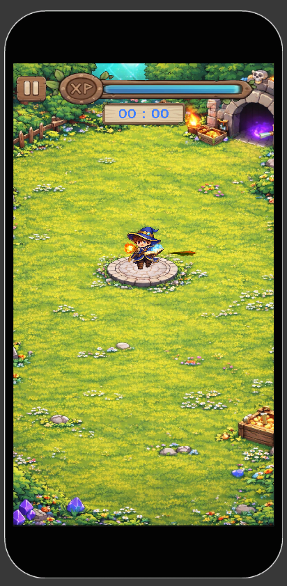
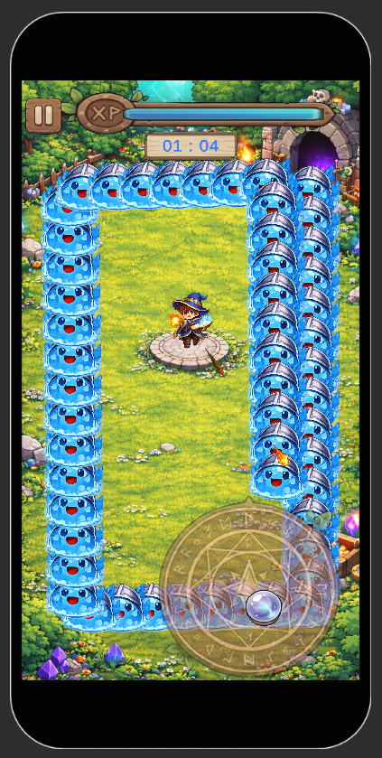

# 슬라임 디펜스 (Slime Defense)

> Unity ECS(DOTS) 기반 모바일 성장형 디펜스 게임  
> 1인 개발 | Android 빌드 완료 | 2026.05.07 완성

<br/>

## 프로젝트 소개

**슬라임 디펜스**는 모바일 환경을 기준으로 제작한 성장형 디펜스 게임입니다.  
플레이어는 중앙에 고정된 상태로 자동 전투를 진행하고, 전투 중 경험치를 획득해 레벨업 보상을 선택하며 성장합니다.

이 프로젝트는 Unity ECS/DOTS를 실제 게임 구조에 적용하고, 다수의 적과 투사체가 동시에 처리되는 상황에서 성능과 구조를 검증하는 것을 목표로 제작했습니다.

<br/>

## 링크

| 항목 | 링크 |
|------|------|
| 플레이 영상 | 준비 중 |
| 플레이 파일 다운로드 | 준비 중 |

<br/>

## 게임 정보

| 항목 | 내용 |
|------|------|
| 플랫폼 | Android |
| 장르 | 디펜스 + 서바이벌 성장형 |
| 개발 인원 | 1인 개발 |
| 개발 기간 | 2026.03.22 ~ 2026.05.07 |
| 플레이 방식 | 중앙 고정형 자동 전투 |
| 클리어 조건 | 제한 시간 동안 생존 |
| 실패 조건 | 플레이어 체력 소진 |

<br/>

## 게임 루프

```text
전투 시작
→ 적 웨이브 스폰
→ 자동 전투 진행
→ 경험치 획득
→ 레벨업 보상 선택
→ 능력 강화
→ 제한 시간 생존 시 클리어 / 체력 소진 시 실패
```

<br/>

## 사용 기술

| 기술 | 용도 |
|------|------|
| Unity 6000.3.11f1 | 게임 엔진 |
| C# | 게임 로직 구현 |
| Unity ECS / DOTS | 적, 투사체, 충돌 처리 |
| Unity Entities | Entity / Component / System 구조 구현 |
| Burst Compiler | ECS Job 최적화 |
| Job System | 대량 Entity 병렬 처리 |
| Addressables | 씬 및 에셋 비동기 로딩 |
| Unity Input System | 모바일 입력 처리 |
| URP | 2D 렌더링 |

<br/>

## 프로젝트 구조

```text
Assets/
├── 1.Scenes/                  # Bootstrap, Loading, Game, SubScene
├── 2.Scripts/
│   ├── ECS/
│   │   ├── Authorings/        # MonoBehaviour → Entity 변환용 Authoring
│   │   ├── Bakers/            # Baker 구현
│   │   ├── Bridge/            # ECS ↔ MonoBehaviour 연결
│   │   ├── Entity Structs/    # IComponentData / BufferElementData 정의
│   │   └── Entity Systems/    # ECS System 구현
│   │       ├── 1.Spawn/       # 적, 무기, 투사체 생성
│   │       ├── 2.Move/        # 적/투사체 이동
│   │       ├── 3.Judgement/   # Grid 기반 충돌 판정
│   │       ├── 4.Calculate/   # 데미지, 관통, 생존 계산
│   │       └── 5.Dead/        # Entity 제거 처리
│   ├── Loading/               # Addressables 씬 로딩, SubScene 로딩
│   ├── DownLoad/              # Addressables 다운로드 관리
│   ├── Input/                 # 입력 처리
│   ├── UI/                    # 게임 UI
│   └── Utility/               # Singleton, ObjectPool 등 공통 유틸
├── 3.InputSystem/             # Input Action Asset
├── 4.Prefabs/                 # 게임 프리팹
└── AddressableAssetsData/     # Addressables 설정
```

<br/>

## ECS 시스템 흐름

```text
SlimeDefenseSystemGroup
│
├── SpawnSystemGroup
│   └── 적 스폰, 무기 발사, 투사체 생성
│
├── MoveSystemGroup
│   └── 적 이동, 투사체 이동
│
├── JudgementSystemGroup
│   └── Grid 기반 충돌 판정
│
├── CalculateSystemGroup
│   └── 데미지 계산, 투사체 관통 체크, 생존 상태 처리
│
└── DestroySystemGroup
    └── 비활성 Entity 제거
```

<br/>

## 주요 구현 내용

### 1. ECS 기반 적/투사체 처리

- 적과 투사체를 Entity로 관리
- `EnemyTag`, `ProjectileTag`, `LiveTag` 등 태그 컴포넌트로 처리 대상 구분
- `LiveTag`를 이용해 비활성 Entity를 즉시 삭제하지 않고 프레임 말에 일괄 제거
- 다수의 적과 투사체 이동을 ECS System과 Job으로 처리

<br/>

### 2. Grid 기반 충돌 처리

- 매 프레임 적 위치를 Grid Cell에 등록
- `NativeParallelMultiHashMap<int, Entity>`를 사용해 Cell별 적 Entity 관리
- 투사체는 전체 적을 검사하지 않고 주변 Cell만 확인
- 충돌 시 적의 `Damaged` Buffer에 데미지 누적
- 데미지 계산 시스템에서 누적 데미지를 한 번에 처리

<br/>

### 3. Addressables 기반 씬 로딩

- 게임 씬을 Addressables로 비동기 로드
- Loading Scene을 유지하면서 Game Scene을 교체하는 구조 사용
- ECS SubScene은 별도 Entity Scene으로 관리
- Android 빌드에서 Addressables와 Entity Scene 포함 관계를 검증

<br/>

### 4. 레벨업 선택 시스템

- 전투 중 경험치 획득
- 레벨업 시 3개의 보상 후보 표시
- 선택한 보상에 따라 능력 강화
- 전투 흐름을 끊지 않도록 UI와 게임 상태를 분리하여 처리

<br/>

## 문제 발생 및 해결

### 1. SubScene / Entity Scene이 APK에 포함되지 않는 문제

**문제 상황**  
Editor에서는 ECS SubScene이 정상적으로 동작했지만, Android APK 빌드 후 실행하면 ECS 데이터가 로드되지 않는 문제가 발생했습니다.

**원인**  
메인 게임 씬을 Addressables로 로드하고 있었기 때문에, 씬 안에서 사용하는 ECS SubScene의 Entity Scene 파일이 APK 빌드에 포함되지 않았습니다.  
즉, Addressables 씬 로딩과 ECS Entity Scene 빌드 포함 처리가 서로 별도로 동작하는 구조였습니다.

**해결 방법**  
빌드에 항상 포함되는 Bootstrap Scene에서 SubScene을 직접 참조하도록 구조를 변경했습니다.  
그 결과 Android 빌드 시 Entity Scene 데이터가 함께 포함되었고, 실제 APK 실행 환경에서도 ECS 데이터가 정상적으로 로드되었습니다.

```text
문제:
Addressables Game Scene 안의 SubScene 참조만으로는 Entity Scene이 APK에 포함되지 않음

해결:
Bootstrap Scene에서 SubScene을 직접 참조

결과:
APK 빌드에 Entity Scene 데이터가 포함되어 Android 실기기에서 정상 로드
```

<br/>

### 2. 대량 적/투사체 충돌 누락 문제

**문제 상황**  
적과 투사체가 많아질수록 일부 투사체 충돌이 누락되거나, 투사체가 설정된 관통 수보다 많은 적을 통과하는 문제가 발생했습니다.

**원인**  
처음에는 Grid Buffer 용량 부족을 의심했지만, 실제 적 수보다 Buffer 용량이 충분했기 때문에 원인이 아니었습니다.  
분석 결과, 렌더링 정렬에 사용하는 좌표 기준과 충돌 판정에 사용하는 좌표 기준이 섞여 충돌 거리가 잘못 계산되는 문제가 있었습니다.

**해결 방법**  
렌더링 정렬용 좌표와 충돌 판정용 좌표를 분리했습니다.  
또한 모든 적을 직접 검사하는 방식 대신 Grid 기반 공간 분할 구조를 적용해, 투사체 주변 Cell에 있는 적만 충돌 후보로 검사하도록 변경했습니다.

```text
문제:
투사체가 실제 설정된 관통 수보다 많은 적을 통과하거나 충돌이 누락됨

원인:
렌더링 정렬 기준과 충돌 판정 기준이 섞여 충돌 거리 계산이 어긋남

해결:
렌더링 좌표와 충돌 좌표 분리
Grid 기반 공간 분할로 주변 Cell만 검사

결과:
충돌 판정 안정성 개선
대량 적/투사체 상황에서도 불필요한 전체 탐색 감소
```

<br/>

## 빌드 환경

```text
Unity              : 6000.3.11f1
Target Platform    : Android
Scripting Backend  : IL2CPP
Architecture       : ARM64
Render Pipeline    : URP
ECS Package        : com.unity.entities
Addressables       : com.unity.addressables
Input System       : com.unity.inputsystem
```

<br/>

## 스크린샷

> 인게임 스크린샷




<br/>

## 개발 정보

| 항목 | 내용 |
|------|------|
| 개발 형태 | 1인 개발 |
| 담당 범위 | 기획, 프로그래밍, ECS 구조 설계, Addressables 로딩, Android 빌드 |
| 그래픽 | AI 이미지 생성 및 무료 리소스 활용 |
| 사운드 | 무료 에셋 활용 |

<br/>

## 개발 목적

이 프로젝트는 단순한 기능 구현보다, Unity ECS/DOTS를 실제 모바일 게임 구조에 적용하면서 다음 내용을 검증하는 것을 목표로 했습니다.

- ECS 기반 대량 Entity 처리
- Grid 기반 충돌 최적화
- Addressables와 ECS SubScene의 빌드 구조 검증
- Android 실기기 빌드 및 실행
- MonoBehaviour UI와 ECS 로직의 역할 분리

<br/>

---

> 본 프로젝트는 Unity ECS/DOTS를 실제 게임에 적용하며, 모바일 환경에서 대량 Entity 처리 구조와 Addressables 기반 씬 로딩 구조를 검증하기 위해 제작되었습니다.
